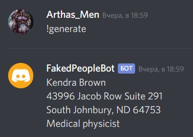

# FakedPeopleBot

This program is a group study project for ITMO University. </br> It allows to generate fake people's data. </br>

## Installing dependencies
To install dependencies run these commands:</br>
``` $ pip3 install discord.py ```</br>
``` $ pip3 install Faker ```

## Set up settings in [config](https://github.com/turingsquad/FakedPeopleBot/tree/master/config) directory

Replace 'sub' in [config.ini](https://github.com/turingsquad/FakedPeopleBot/blob/master/config/config.ini) file.</br>You should paste a token of your bot here:
```
[Bot]
token = stub
```

## How to run this bot?

In commad line you run this and bot is working:</br>
` python3 run_bot.py `

## Add bot to your server in discord

To add this bot, you just need to click this [link](https://discordapp.com/oauth2/authorize?&client_id=643102079392677898&scope=bot&permissions=34816) and choose a server. After this you are able to use your bot freely.

## What can this bot do?

***!generate — to generate a person</br>***
***!ping — checks if the bot is alive. Expected answer — "pong"</br>***
***!help — standart command which shows you all the abilities of the bot***</br>

## Preffix of the commands

If you want to change the preffix, you can simply correct it and pass it as a parametr in **get_bot** function.

## Example of output




## Maintainers:
Many thanks to all those who participated in the development of the bot:

1. Alexander Kosturenko - [Arthasasyan](https://github.com/Arthasasyan)
2. Ilya Elikov - [ilyashn](https://github.com/ilyashn)
3. Ekaterina Ladokhina - [jnannni](https://github.com/jnannni)
4. Alina Terekhova - [atereh](https://github.com/atereh)
5. Anna Doshchenko - [anna2506](https://github.com/anna2506)